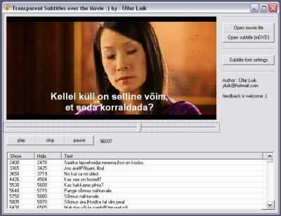



## Transparent subtitle over movie

### Description

Show how to put transparent subtitles over the movie :) it's very simple.
 
### More Info
 

             |
---                |---
**Submitted On**   |2003-11-03 07:31:04
**By**             |[Üllar Luik](https://github.com/Planet-Source-Code/PSCIndex/blob/master/ByAuthor/llar-luik.md)
**Level**          |Intermediate
**User Rating**    |4.2 (21 globes from 5 users)
**Compatibility**  |VB 6\.0
**Category**       |[Graphics](https://github.com/Planet-Source-Code/PSCIndex/blob/master/ByCategory/graphics__1-46.md)
**World**          |[Visual Basic](https://github.com/Planet-Source-Code/PSCIndex/blob/master/ByWorld/visual-basic.md)
**Archive File**   |[Transparen1666841132003\.zip](https://github.com/Planet-Source-Code/llar-luik-transparent-subtitle-over-movie__1-49626/archive/master.zip)

